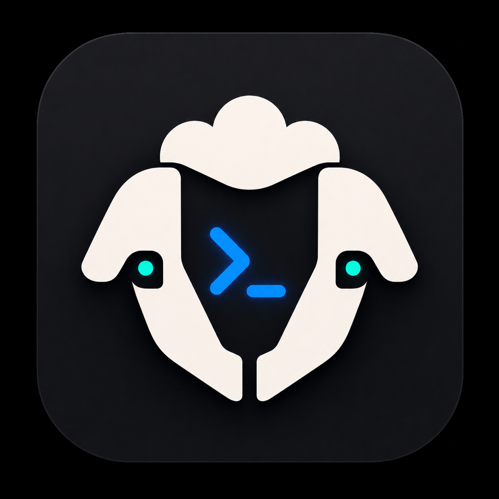

# Muster

<p align="center">
  
</p>

Muster is a proposed Mac-first command center for coding agents.

The app is intended to feel like Unpeel's native terminal-agent workflow, but with Herdr as the persistent session backend instead of tmux. The terminal surface should ideally be powered by Ghostty/libghostty, with a Swift-first macOS application around it and a later iPhone companion app for monitoring and controlled handoffs.

## Status

This repository is currently an architecture and product-planning scaffold. The implementation target is a Mac-first Swift app, with Herdr providing durable terminal sessions and Ghostty/libghostty providing the embedded terminal experience. An iPhone companion app is now included as a later planning target for monitoring and controlling Mac-hosted sessions, not for replacing the Mac terminal stack on iOS.

## Core idea

Muster should let a developer launch, monitor, attach to, and coordinate many long-running coding-agent sessions from one Mac app, then keep track of the most important session state from iPhone when they are away from the keyboard.

The important product bets are:

- Herdr owns durable shells, panes, workspaces, worktrees, and agent detection.
- Muster owns the native macOS experience, orchestration UI, and cross-agent workflows.
- Ghostty/libghostty owns terminal rendering and interaction quality.
- A local MCP bridge lets agents inspect and coordinate sibling sessions safely.

## Planned structure

```text
Muster.app
  SwiftUI/AppKit native macOS UI
  HerdrKit for Herdr socket and CLI integration
  GhosttyKit for embedded terminal rendering
  MusterBridgeClient for local MCP bridge control

Muster Helper
  Supervises Herdr and optional bridge services

Muster Bridge
  Local MCP server for safe cross-agent coordination

Muster iPhone
  Companion SwiftUI app for session monitoring, notifications, and approved control actions
```

## Documentation

- [Product Brief](docs/00-product-brief.md)
- [System Architecture](docs/01-system-architecture.md)
- [macOS App Structure](docs/02-macos-app-structure.md)
- [Herdr Integration](docs/03-herdr-integration.md)
- [Ghostty Terminal Integration](docs/04-ghostty-terminal-integration.md)
- [MCP Bridge](docs/05-mcp-bridge.md)
- [Development Phases](docs/06-development-phases.md)
- [Risks and Open Questions](docs/07-risks-and-open-questions.md)
- [iPhone Companion App](docs/08-iphone-companion-app.md)

## Proposed name

**Muster** means gathering a group for action. That maps well to a tool that gathers coding agents, terminal sessions, worktrees, and status into one native control surface.

## Logo

The working logo is an original generated mark for Muster. It is intentionally inspired by terminal-agent tooling, Herdr's coordination theme, and Ghostty's native terminal polish without copying either project's logo.
